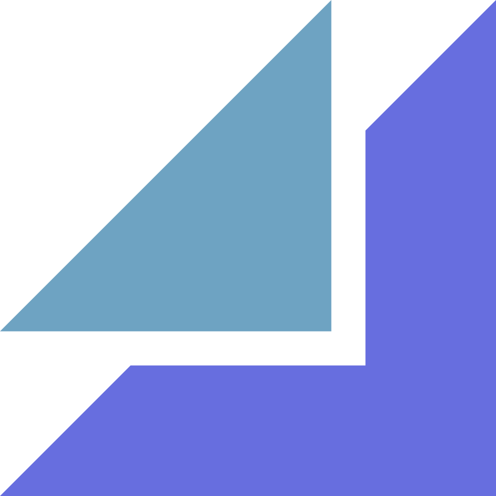
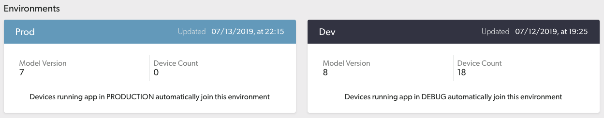

- TOC
{:toc}

# About Skafos

[Skafos](https://skafos.ai) helps you deliver the power of machine learning to your mobile applications:

* **Management**
    * Upload your own custom models from any training environment (cloud or local) to the [dashboard](https://dashboard.skafos.ai)
    * Store and manage models associated with your app in a streamlined versioning interface
* **Deployment**
    * Deliver or roll-back model versions to deployment environments (dev or prod)
    * Update models over-the-air without resubmitting your entire application to the app store
* **Monitoring**
    * Track active devices, model installations, and other analytics all in one spot

A recommended functional architecture looks something like this:

# Platform Overview

## Organizations
You build with Skafos as an **Organization** (either an *individual* or a *team of collaborators*). For a given organization, Skafos has the following components:
- [Applications](#applications)
- [Environments](#environments)
- [Models](#models)
- [Model Versions](#model versions)

## Applications
An **Application** on Skafos represents an iOS app integration. Create a new application for each new iOS app that has a unique bundle ID.

The structure for a typical application is shown on the left and a more complex application is shown on the right:

## Environments
Utilize application **Environments** to manage model version deployments to either Dev or Prod.

## Models
**Models** represent a component of your application powered by a machine learning artifact.

- Each model is a collection of model versions as they are updated over time.
- Create a new Skafos model for each discrete ML-powered feature.

*At this level of the platform you can manage model version uploads and deployments.*

## Model Versions
**Model Versions** are deployable machine learning artifacts such as Core ML or TensorFlow Lite files, uploaded from either a training environment (Python SDK) or with "Drag n Drop" on the dashboard.

- Model versions are automatically version-controlled once uploaded.
- Model versions may be assigned to environments.
- Model versions are zipped archives. *Skafos compresses on your behalf in the python SDK. If you use the dashboard, you are required to zip your files prior to upload.*

# Development Tools
Skafos provides three tools to get started:

### [Python SDK](https://pypi.org/project/skafos/)
A Python wrapper for uploading, fetching, and listing model versions from the platform.

### [iOS Framework](https://github.com/skafos/ios)
An iOS framework for managing model deployments in your mobile application.

### Dashboard

# Resources

## Integration Guide

## Code Examples

* [Image Classification iOS App]
* [Object Detection iOS App]
* [Text Classification iOS App]
* [Other Example ML Apps]
* [Model Training on Google Colab]
* [Model Training on AWS Sagemaker]
* [Model Training on Microsoft Azure]

## FAQs
Read through our set of [FAQs](sections/faq.md) (Frequently Asked Questions).

## Other Resources
- [Visit our YouTube channel](https://www.youtube.com/channel/UCPufR0t13R-eHEW0OPCmrPw) for step-by-step tutorials and other helpful content.
- [Check out our Blog @ Medium](https://medium.com/skafosai).

## Slack
Join our Slack Community! Click the icon below.

