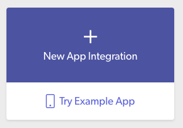
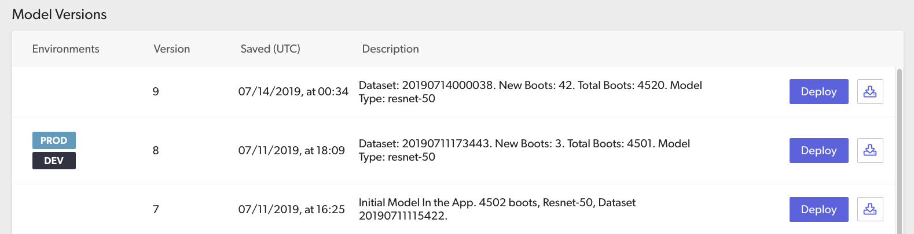
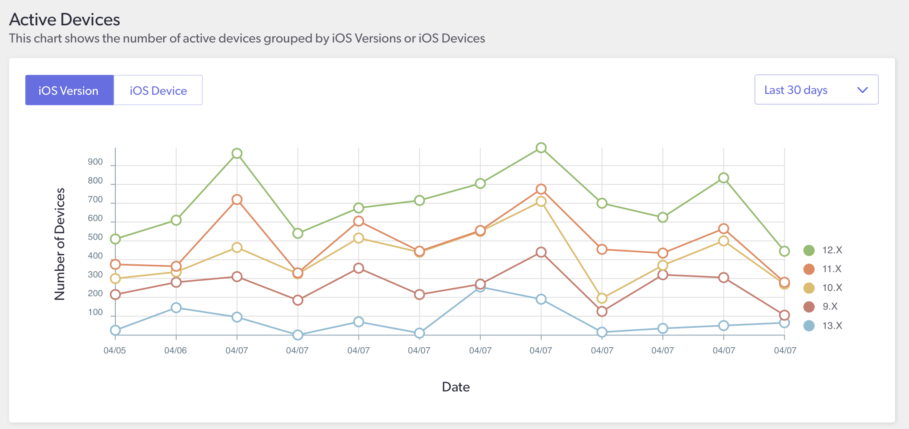

##### Deliver the power of machine learning to your mobile applications.

__
* **Management**
    * Upload custom models from any training environment to the [dashboard](https://dashboard.skafos.ai)
    * Store and version models associated with your app
* **Deployment**
    * Deliver or roll-back model versions to environments (dev or prod)
    * Update models over-the-air without resubmitting your entire application to the app store
* **Monitoring**
    * Track active devices, model installations, and other analytics all in one spot

A recommended functional architecture looks something like this:


# Platform Overview

### Organizations
You build with Skafos as an **Organization** (either an *individual* or a *team of collaborators*). For a given organization, Skafos has the following components:
- [Applications](#applications)
- [Environments](#environments)
- [Models](#models)
- [Model Versions](#model versions)

### Applications
An **Application** on Skafos represents an iOS app integration. Create a new application for each new iOS app that has a unique [Bundle ID](https://developer.apple.com/documentation/appstoreconnectapi/bundle_ids).

The structure for a *typical application* is shown on the left and a more *complex application* is shown on the right:


### Environments
Utilize application **Environments** to manage model version deployments to either Dev or Prod.


### Models
**Models** represent a component of your application powered by a machine learning artifact.

- Each model is a collection of model versions as they are updated over time.
- Create a new Skafos model for each discrete ML-powered feature.

### Model Versions
**Model Versions** are deployable machine learning artifacts such as Core ML or TensorFlow Lite files ready to run inference on-device.

- Model versions are automatically version-controlled once uploaded.
- Model versions may be assigned to environments.

# Development Tools
Skafos provides three development tools to get started.

## [Python SDK](https://pypi.org/project/skafos/)
A Python wrapper for uploading, fetching, and listing model versions from the platform. Install the SDK using the pip package manager:
```bash
$ pip install skafos
```
Visit the [SDK Documentation](https://sdk.skafos.ai) for available methods and usage guide.

## [iOS Framework](https://github.com/skafos/ios)
An iOS framework for managing model deployments in your mobile application. Visit the [Integration Guide](sections/integrate.md) for usage details.

## [Dashboard](https://dashboard.skafos.ai)
A web-based user interface designed to help you do the following:

#### Create New App Integrations



  - Start with an example app
  - Bring your own; start with a custom app

#### Upload, Manage, & Deploy Models



  - Version and organize your models and applications
  - Deploy or roll-back model versions to different environments

#### Monitor Apps & Models



  - Track *total installations* and *iOS specs* (device type and iOS version) for active devices using your deployed models
  - View the adoption rate of your newly deployed model versions

[Create a free account and login to get started!](https://dashboard.skafos.ai/sign-up)

# Resources
We've assembled a collection of resources to help you learn and start using Skafos today.

### Integration Guide
Learn [how to integrate your app](sections/integrate.md) with Skafos.

### Code Examples
If you prefer to learn by example:
* [Image Classification iOS App](https://github.com/skafos/ImageClassificationIOS)
* [Object Detection iOS App](https://github.com/skafos/ObjectDetectionIOS)
* [Text Classification iOS App](https://github.com/skafos/TextClassificationIOS)
* [More Example ML Apps](https://github.com/skafos/example-ml-apps)
* [Model Training on Google Colab](https://github.com/skafos/colab-example-models)
* [Model Training on AWS Sagemaker](https://github.com/skafos/sagemaker-example-models)
* [Model Training on Microsoft Azure](https://github.com/skafos/azure-example-models)

### FAQs
Read through our set of [FAQs](sections/faq.md) (Frequently Asked Questions).

### Other Resources
- [Visit our YouTube channel](https://www.youtube.com/channel/UCPufR0t13R-eHEW0OPCmrPw) for step-by-step tutorials and other helpful content
- [Check out our Blog @ Medium](https://medium.com/skafosai)

### Slack
[](https://skafosai.slack.com/join/shared_invite/enQtNTAxMzEwOTk2NzA5LThjMmMyY2JkNTkwNDQ1YjgyYjFiY2MyMjRkMzYyM2E4MjUxNTJmYmQyODVhZWM2MjQwMjE5ZGM1Y2YwN2M5ODI)
Join our Slack Community!
